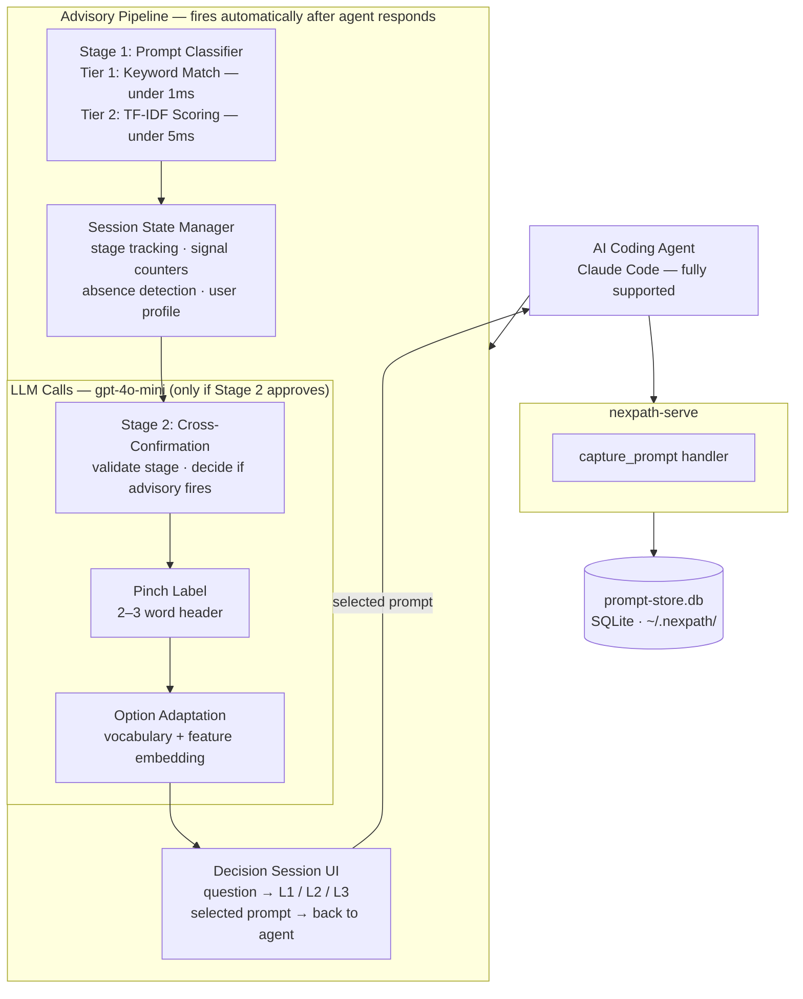

# Nexpath CLI — Build Fast. Skip Nothing.

> **A behaviour guidance layer for builders working with AI coding agents — vibe coders, indie hackers, founders, and product managers.**

Nexpath gives developers meaningful direction while they work with AI coding agents and AI code tools — helpful suggestions at the right moment that protect developer productivity, without slowing you down.

---

## What Is Nexpath CLI?

- A behaviour guidance system and developer productivity layer for builders using AI coding agents and AI code tools.
- Monitors your development sessions and understands where you are in your project lifecycle.
- Surfaces **"the decision session"** — a lightweight prompt that gives direction without forcing your hand.
- Presents pre-filled agent prompts you select with one keypress — ready-to-send, not just tips.
- Want to tweak one first? Copy it to your clipboard, then paste and edit before sending.
- None fit? Skip it and revisit skipped items later in one focused session.

---

## Architecture



---

## Why AI Coding Assistant for Builders

- AI coding agents and coding AI tools can generate entire features from a single sentence.
- But speed of generation often outpaces the discipline of process.
- Developers skip reviews, forget regression checks, ship without acceptance tests — out of momentum, not laziness.
- Nexpath appears at the right moments with the right questions, closing the gap between what AI generates and what disciplined development requires.

Built during AI Hackfest 2026 by MLH.

---


---

## Nexpath CLI Features & Capabilities

### The Decision Session

The core interaction:

- Fires when Nexpath detects a stage transition in your workflow.
- Presents structured options aligned with where you are in your project.
- Each option is a pre-filled prompt — pick it to send straight to your AI agent, or copy it to edit first.

The decision session cascades through three levels:
- **Level 1** — Full-depth recommendations for thorough development practice
- **Level 2** — Lighter alternatives when you're short on time
- **Level 3** — Minimum viable step — one small action that still moves you forward

Select "Show simpler options →" to move down a level. Select "Skip for now" to record the item
and revisit it later with `nexpath optimize` (available in future versions). Want to adjust a prompt before sending? Select
**"Copy to clipboard — edit before sending"** — it lands on your clipboard to paste and tweak.

### Absence Detection

- Tracks which development signals are present or missing in your session.
- If you've coded 15+ prompts in a confirmed stage without mentioning tests, cross-confirmation, or regression checks, it raises an absence flag.
- Offers relevant suggestions to fill the gap.

### Supported AI Coding Agents & Developer Tools

Nexpath CLI is built for prompt capture across AI coding agents.

| Agent | Status in v0.1.2 |
|-------|-----------------|
| **Claude Code** | Fully supported — end-to-end tested |
| **Cursor** | Not yet supported — end-to-end testing planned for v0.1.3 |
| **Windsurf** | Not yet supported — end-to-end testing planned for v0.1.3 |
| **Cline** | Not yet supported — end-to-end testing planned for v0.1.3 |
| **Roo Code** | Not yet supported — end-to-end testing planned for v0.1.3 |
| **KiloCode** | Not yet supported — end-to-end testing planned for v0.1.3 |
| **OpenCode** | Not yet supported — end-to-end testing planned for v0.1.3 |

---

## Claude Code Setup & Installation

```bash
# Clone and build from source
git clone https://github.com/hi0001234d/nexpath.git
cd nexpath
npm install
npm run build
npm link

# Register with your coding agent and verify
nexpath install
nexpath install --yes      # or accept defaults without prompts

# Verify
nexpath --version
```

Setup notes:
- You'll choose how often advisories appear (advisory frequency) and what kind of work you do (project role).
- Both can be changed later — when an advisory popup appears, press Ctrl+T (Cmd+T on macOS) to change them.

### Uninstalling

```bash
# Remove the Nexpath CLI
nexpath uninstall
npm uninstall -g nexpath
npm unlink -g nexpath

# Verify it's gone
npm list -g nexpath
which nexpath

# Clear local data and caches
rm -rf ~/.nexpath
rm -rf ~/.config/nexpath
rm -rf ~/.local/share/nexpath
rm -rf ~/.cache/nexpath

# Clear the npm cache
npm cache clean --force
```

`nexpath uninstall` disconnects Nexpath from all detected agents and offers to clear the stored
API key. The remaining steps remove the global package, any leftover binary, and all local
data and caches.

---

## Configuration and Privacy

### Privacy Controls

All data is stored **locally only** at `~/.nexpath/`. Only targeted LLM calls per decision
session leave your machine.

- **Automatic secret redaction** — API keys (`sk-*`, `ghp_*`, `ghu_*`), bearer tokens, and
  PEM blocks are automatically stripped from prompts before storage.
- **Install-time consent** — During `nexpath install`, telemetry is a separate consent step
  (defaults to enabled). Local prompt capture and remote telemetry are independent — disable
  either anytime via `nexpath store disable`(if you do this, nothing will work) or
  `nexpath config set telemetry.enabled false`.

### Deleting Stored Prompts

```bash
# Delete prompts for a specific project you no longer want to keep
nexpath store delete --project <path>

# Delete all stored prompts permanently
nexpath store delete -y
```

---

## Troubleshooting

### Where Is My API Key Stored?

| Platform | Default location | Inspect with |
|---|---|---|
| macOS | Keychain | Keychain Access.app → search "nexpath" |
| Linux | Secret Service (libsecret) | `secret-tool lookup service nexpath account openai_api_key` |
| Windows | Credential Manager | Control Panel → Credential Manager → Web Credentials |
| Fallback (any OS) | `~/.nexpath/config.json` (mode 0600) | `cat ~/.nexpath/config.json` |

Use `nexpath config show-key-source` to confirm which layer is currently active.

---

## Contributing

Contribution guide coming once the initial implementation is stable.

---

## License

[Apache License 2.0](LICENSE)

---

## Acknowledgements

- **Major League Hacking (MLH)** — For organizing AI Hackfest 2026
- **Anthropic** — For Claude Code, our primary development environment
- **OpenAI** — For gpt-4o-mini, used for cross-confirmation and pinch label generation
- **Google** — For Gemini AI, planned as an alternative LLM provider alongside OpenAI

Built with insights from the vibe coding community and developers building real projects with AI coding agents, coding AI tools, and AI developer tools.
