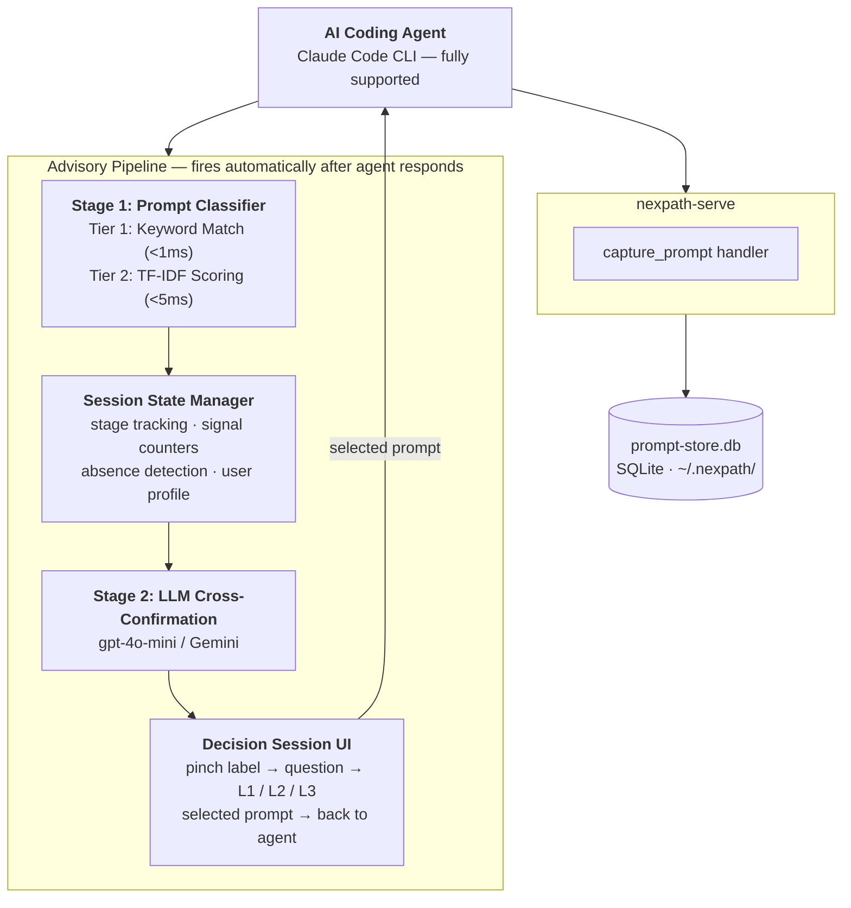

# Nexpath

> **A behaviour guidance layer for vibe coders and coding-agent users.**

Nexpath gives developers meaningful direction while they work with AI coding agents — helpful suggestions at the right moment, without slowing you down.

---

## What Is Nexpath?

Nexpath is a behaviour guidance system for developers using AI coding 
agents. It monitors your development sessions, understands where you are in your 
project lifecycle, and surfaces **"the decision session"** — a 
lightweight prompt that gives you meaningful direction without ever 
forcing your hand.

When Nexpath detects a meaningful moment in your workflow — like 
moving from planning to architecture, or finishing a task without 
running tests — it presents pre-filled agent prompts you can select 
with one keypress. These aren't tips. They're ready-to-send prompts 
that tell your AI agent exactly what to do next.

If none fit at all, skip it and revisit skipped items later in one focused session

---

## Architecture



---

## Why Nexpath Exists

AI coding agents can generate entire features from a single sentence — 
but the speed of generation often outpaces the discipline of process. 
Developers skip reviews, forget regression checks, ship without 
acceptance tests. Not out of laziness — out of momentum.

Nexpath closes the gap between what AI agents can generate and what 
disciplined development actually requires. It appears at the right 
moments with the right questions: _"You just finished a feature. 
Want to cross-confirm before moving on?"_

Built during AI Hackfest 2026 by MLH.

---

## Features

### The Decision Session

The core interaction. When Nexpath detects a stage transition in your development workflow, it
presents structured options aligned with where you are in your project lifecycle. Each option
is a pre-filled prompt ready to send to your AI agent — select it and hit Enter.

The decision session cascades through three levels:
- **Level 1** — Full-depth recommendations for thorough development practice
- **Level 2** — Lighter alternatives when you're short on time
- **Level 3** — Minimum viable step — one small action that still moves you forward

Select "Show simpler options →" to move down a level. Select "Skip for now" to record the item
and revisit it later with `nexpath optimize`. (Not yet implemented in v0.1.1 — coming in v0.1.4.)

Decision sessions fire at key moments: moving from idea to planning, planning to architecture,
architecture to task breakdown, completing a task, finishing a phase, and pre-release checks.

### Vocabulary and Tone Calibration

Nexpath reads your prompt history to calibrate whether you are a pure vibe coder, a
product-minded builder, or an experienced architect. It classifies your developer nature into
one of four archetypes (Beginner, Cool Geek, Hardcore Pro, or Pro-Geek Soul) and detects your
current session mood (focused, excited, frustrated, casual, rushed, or methodical). This shapes
the tone and wording of the creative 2–3 word labels that open each decision session.

### Prompt Classification

Nexpath classifies your prompts against 8 development stages using a two-tier cascade:
- **Tier 1 — Keyword matching** (<1ms): Fast pattern detection against curated signal vocabulary
- **Tier 2 — TF-IDF scoring** (<5ms): Statistical text analysis when keywords are ambiguous

Before surfacing a decision session, a lightweight LLM call cross-confirms the classifier's
detection to reduce false positives.

### Absence Detection

Nexpath tracks which development signals are present or missing in your session. If you've been
coding for 15+ prompts in a confirmed stage without mentioning tests, cross-confirmation, or
regression checks, it raises an absence flag and offers relevant suggestions.

### Agent Support

Nexpath is built for prompt capture across AI coding agents.

| Agent | Status in v0.1.1 |
|-------|-----------------|
| **Claude Code** | Fully supported — advisory hook registration, end-to-end tested |
| **Cursor** | Config detection implemented; end-to-end testing planned for v0.1.3 |
| **Windsurf** | Config detection implemented; end-to-end testing planned for v0.1.3 |
| **Cline** | Config detection implemented; end-to-end testing planned for v0.1.3 |
| **Roo Code** | Config detection implemented; end-to-end testing planned for v0.1.3 |
| **KiloCode** | Config detection implemented; end-to-end testing planned for v0.1.3 |
| **OpenCode** | Config detection implemented; end-to-end testing planned for v0.1.3 |

---

## Installation

```bash
# Clone and build from source
git clone https://github.com/hi0001234d/nexpath.git
cd nexpath
npm install
npm run build
npm link

# Register with your coding agent and verify
nexpath install --yes
nexpath status
```
> **Note:** Nexpath is currently fully supported on **Claude Code CLI** — other agents are planned for v0.1.3.  

### Environment Variables

set it per project using a `.env` file:

```bash
cd /path/to/your-project
echo 'OPENAI_API_KEY=sk-your-key-here' > .env
claude
```

> This will directly start Claude Code using your project environment.

Without an API key, Nexpath still functions — it falls back to static pinch labels and skips
LLM cross-confirmation. The local classifier and decision session UI work fully offline.

To uninstall:

```bash
nexpath uninstall
```

---

## The Decision Session — How It Works

1. **Detection** — As you work with your coding agent, Nexpath captures each prompt
   and classifies your development stage in <5ms using keyword matching and TF-IDF scoring.

2. **Trigger** — When a stage transition is detected (e.g., you've moved from planning to
   coding), a lightweight LLM call confirms the detection. If confirmed, the decision session
   fires. By design, this should happen after the agent has fully responded to the user's
   prompt — never mid-response. In v0.1.1 there is a known UI timing issue where the
   decision session UI can fire during prompt processing; this is being fixed in v0.1.2.

3. **Presentation** — A 2–3 word creative label appears (e.g., "Before coding.", "Quick check."),
   followed by a question and a set of pre-filled prompt options across three levels.

4. **Selection** — Pick an option to send it directly to your agent, or select
   "Show simpler options" to see lighter alternatives. Select "Skip for now" to record the
   item and move on.

5. **Replay** — Revisit all skipped items anytime in one focused session.

---

## Configuration and Privacy

### Privacy Controls

All data is stored **locally only** at `~/.nexpath/`. Nothing leaves your machine except
targeted LLM calls per decision session (sending only session context — last 10 prompts and
detected stage).

- **Automatic secret redaction** — API keys (`sk-*`, `ghp_*`, `ghu_*`), bearer tokens, and
  PEM blocks are automatically stripped from prompts before storage. If a prompt contains
  sensitive credentials, they never reach the database.
- **First-run disclosure** — on the very first prompt capture, Nexpath prints a privacy banner
  explaining exactly what it stores and how to opt out

### Opting Out and Data Control

```bash
# Disable prompt capture (keeps existing data, stops collecting new prompts)
nexpath store disable

# Remove prompts older than 30 days
nexpath store prune --older-than 30d

# Delete all stored prompts permanently
nexpath store delete -y
```

---

## Roadmap

| Version | Status | Description |
|---------|--------|-------------|
| **v0.1.1** | Completed | Core behaviour guidance system — decision sessions, 3-level options, prompt classification, developer profiling. Full Claude Code support. |
| **v0.1.2** | Planned | Fix decision session UI timing — currently the interactive UI fires during prompt processing instead of after the agent has responded. Stabilise the advisory pipeline for production reliability. |
| **v0.1.3** | Planned | Expand end-to-end support to additional coding agents: Cursor, Windsurf, Cline, Roo Code, KiloCode, and OpenCode. |

---

## Contributing

Contribution guide coming once the initial implementation is stable.

Nexpath is developed as an independent project alongside ReviewDuel. Contributions to Nexpath
are tracked in this repo. The ReviewDuel integration is maintained separately.

---

## License

[Apache License 2.0](LICENSE)

---

## Acknowledgements

- **Major League Hacking (MLH)** — For organizing AI Hackfest 2026
- **Anthropic** — For Claude Code CLI, our primary development environment
- **OpenAI** — For gpt-4o-mini, used for cross-confirmation and pinch label generation
- **Google** — For Gemini AI, planned as an alternative LLM provider alongside OpenAI
- **Model Context Protocol** — For enabling cross-agent prompt capture

Built with insights from the vibe coding community and developers building real projects with AI coding agents.